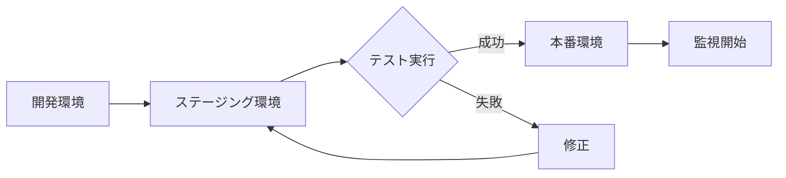

# MLBot プロダクション展開ガイド

## 推奨クラウドサービスとスペック

### 1. AWS (Amazon Web Services) - 推奨

#### 推奨構成
```yaml
# EC2インスタンス
インスタンスタイプ: t3.medium
- vCPU: 2
- メモリ: 4GB
- ネットワーク: 最大5Gbps
- 月額費用: 約$30-40

# ストレージ
EBS (GP3):
- サイズ: 100GB
- IOPS: 3000
- 月額費用: 約$8

# Redis (ElastiCache)
ノードタイプ: cache.t3.micro
- メモリ: 0.5GB
- 月額費用: 約$13

# 合計月額: 約$51-61 (約7,000-8,500円)
```

#### AWS選択の理由
- 東京リージョン(ap-northeast-1)でBybitへの低レイテンシ
- Auto Scaling対応で負荷に応じた自動スケール
- AWS Systems Managerで安全な秘密情報管理
- CloudWatchによる統合監視

### 2. Google Cloud Platform (GCP)

#### 推奨構成
```yaml
# Compute Engine
マシンタイプ: e2-medium
- vCPU: 2
- メモリ: 4GB
- 月額費用: 約$25-35

# Persistent Disk
- タイプ: Standard
- サイズ: 100GB
- 月額費用: 約$4

# Memorystore (Redis)
- Basic Tier: 1GB
- 月額費用: 約$35

# 合計月額: 約$64-74 (約9,000-10,000円)
```

### 3. DigitalOcean - コスト重視

#### 推奨構成
```yaml
# Droplet
タイプ: Basic Regular
- vCPU: 2
- メモリ: 4GB
- SSD: 80GB
- 月額費用: $24

# Managed Redis
- メモリ: 1GB
- 月額費用: $15

# 合計月額: $39 (約5,500円)
```

## デプロイメント手順

### 1. 環境準備

```bash
# 1. リポジトリのクローン
git clone https://github.com/humandebri/mlbot.git
cd mlbot

# 2. 環境変数の設定
cp .env.example .env
# .envファイルを編集して本番用の設定を入力
```

### 2. Dockerを使用したデプロイ

```dockerfile
# Dockerfile.production
FROM python:3.12-slim

WORKDIR /app

# システム依存関係のインストール
RUN apt-get update && apt-get install -y \
    gcc \
    g++ \
    && rm -rf /var/lib/apt/lists/*

# Pythonパッケージのインストール
COPY requirements.txt .
RUN pip install --no-cache-dir -r requirements.txt

# アプリケーションコードのコピー
COPY . .

# ヘルスチェック
HEALTHCHECK --interval=30s --timeout=10s --start-period=5s --retries=3 \
    CMD python -c "import requests; requests.get('http://localhost:8080/health')"

# 起動
CMD ["python", "src/system/main.py"]
```

### 3. Docker Composeによる構成

```yaml
# docker-compose.production.yml
version: '3.8'

services:
  mlbot:
    build:
      context: .
      dockerfile: Dockerfile.production
    environment:
      - ENVIRONMENT=production
      - USE_TESTNET=false
    env_file:
      - .env
    volumes:
      - ./data:/app/data
      - ./logs:/app/logs
      - ./models:/app/models
    restart: unless-stopped
    depends_on:
      - redis

  redis:
    image: redis:7-alpine
    command: redis-server --appendonly yes
    volumes:
      - redis_data:/data
    restart: unless-stopped

volumes:
  redis_data:
```

### 4. セキュリティ設定

```bash
# 1. APIキーの暗号化保存
# AWS Systems Manager Parameter Store使用例
aws ssm put-parameter \
    --name "/mlbot/bybit_api_key" \
    --value "your-api-key" \
    --type "SecureString"

# 2. ファイアウォール設定
# 必要なポートのみ開放
ufw allow 22/tcp  # SSH
ufw allow 443/tcp # HTTPS
ufw enable
```

### 5. 監視とアラート設定

```yaml
# monitoring/prometheus.yml
global:
  scrape_interval: 15s

scrape_configs:
  - job_name: 'mlbot'
    static_configs:
      - targets: ['localhost:9090']

# アラートルール
rule_files:
  - 'alerts.yml'

# alerts.yml
groups:
  - name: mlbot_alerts
    rules:
      - alert: HighErrorRate
        expr: rate(errors_total[5m]) > 0.1
        for: 5m
        annotations:
          summary: "エラー率が高い"
      
      - alert: LowSignalRate
        expr: rate(trading_signals_total[1h]) < 10
        for: 1h
        annotations:
          summary: "取引シグナルが少ない"
```

## 本番運用チェックリスト

### デプロイ前
- [ ] 本番用APIキーの取得と設定
- [ ] USE_TESTNET=false に設定
- [ ] 初期資金の確認（$10,000）
- [ ] Discord Webhookの設定
- [ ] バックアップ戦略の確立

### セキュリティ
- [ ] APIキーの暗号化保存
- [ ] ファイアウォール設定
- [ ] SSH鍵認証の設定
- [ ] 定期的なセキュリティアップデート

### 監視
- [ ] ヘルスチェックエンドポイントの確認
- [ ] ログ収集の設定
- [ ] アラート通知の設定
- [ ] パフォーマンスメトリクスの監視

### リスク管理
- [ ] 最大ポジションサイズの確認（3.5%）
- [ ] ストップロス設定の確認
- [ ] 緊急停止手順の準備
- [ ] 日次損失上限の設定

## 推奨デプロイメントフロー



## 運用コスト見積もり

| サービス | 月額費用 | 年額費用 |
|---------|---------|---------|
| AWS (推奨) | $51-61 | $612-732 |
| GCP | $64-74 | $768-888 |
| DigitalOcean | $39 | $468 |

※ 取引量増加に伴うデータ転送料は別途

## サポートとメンテナンス

1. **定期メンテナンス**
   - 週次: ログローテーション
   - 月次: モデル性能評価
   - 四半期: システムアップデート

2. **バックアップ**
   - 日次: 取引履歴とモデル
   - 週次: フルシステムバックアップ

3. **災害復旧**
   - RPO (Recovery Point Objective): 24時間
   - RTO (Recovery Time Objective): 4時間

## 次のステップ

1. AWSアカウントの作成
2. 本番用Bybit APIキーの取得
3. このガイドに従ってデプロイ
4. 小額でのテスト運用（1週間）
5. 本格運用開始